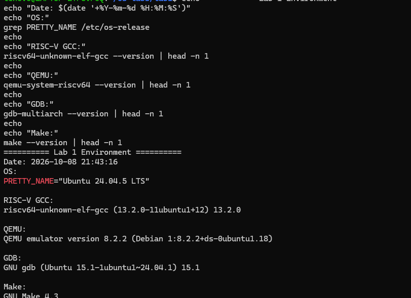
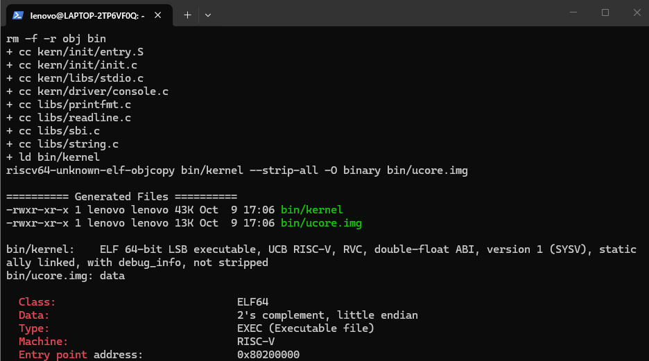
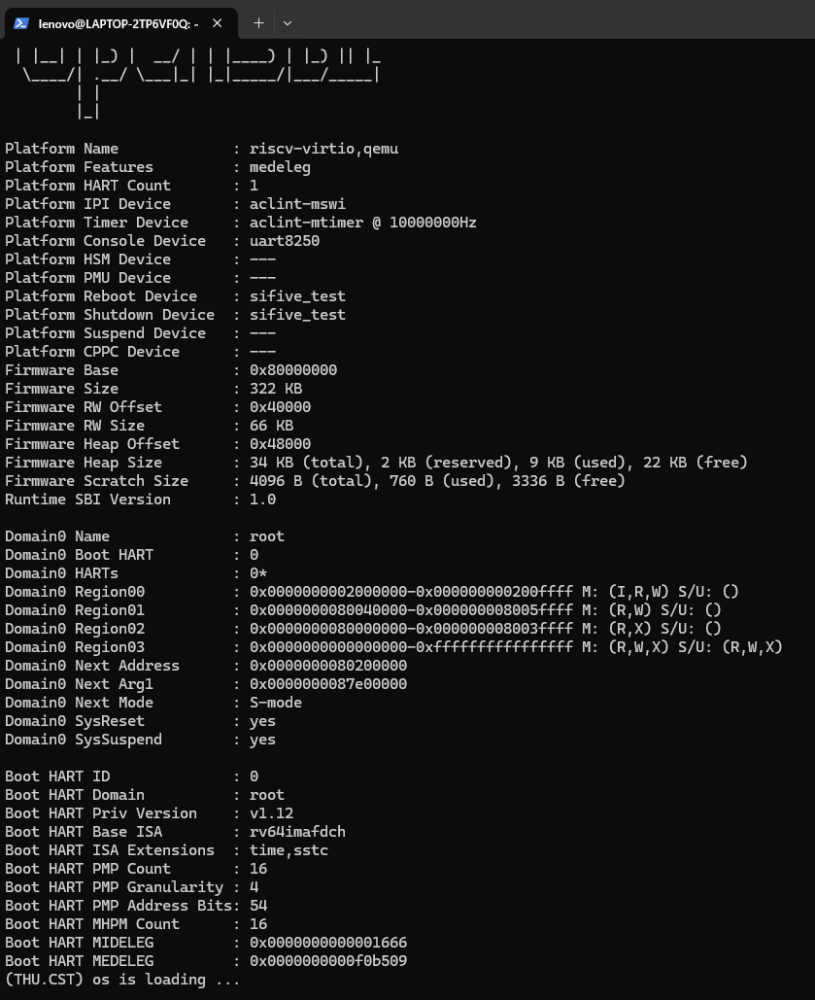
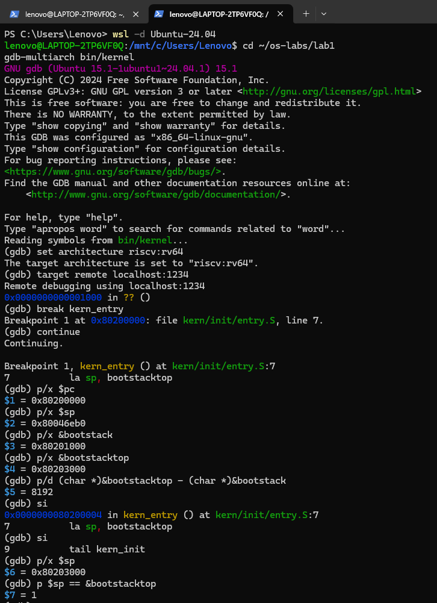

# 操作系统实验报告

## 实验基本信息

| 项目 | 内容 |
|------|------|
| **实验名称** | Lab 1：比麻雀更小的麻雀（最小可执行内核） |
| **小组成员** | 【2412101-张哲宇】、【2410683-刘梓涵】、【2411310-李镕吉】 |
| **完成日期** | 2026-10-8 |

### 小组分工

练习如何分工？

| 成员 | 负责的练习/模块 |
|------|----------------|
| A：【2412101-张哲宇】 | 环境搭建与验证、练习 1-1（Makefile 构建过程）、测试与验证、仓库与提交管理 |
| B：【2410683-刘梓涵】 | 练习 1-3、练习 2、GDB 调试体验、实验整体逻辑分析 |
| C：【2411310-李镕吉】 | 练习 1-2（链接脚本）、SBI 到 stdio 调用链、实验目的与总结、全文格式终检 |

实验报告如何分工？

| 成员 | 负责的报告章节 |
|------|---------------|
| A：【2412101-张哲宇】 | 二、实验环境；四（练习 1-1）；五、测试与验证 |
| B：【2410683-刘梓涵】 | 三、实验整体逻辑分析；四（练习 1-3、练习 2、GDB 调试体验） |
| C：【2411310-李镕吉】 | 一、实验目的；四（练习 1-2、SBI 到 stdio）；六、实验总结与收获；全文组装与格式终检 |

实验报告由三位成员分别完成负责章节，最后统一合并到 `report.md`。A 负责检查分支、目录和提交规范；C 负责全文格式终检及提示词、截图归档。

---

## 一、实验目的

> 本节由 C 负责，以下内容可作为合并基础。

1. 理解一个最小 RISC-V 内核从源文件到可执行镜像的完整构建过程。
2. 理解 ELF 内核与纯二进制镜像的区别，以及链接脚本对内存布局、入口地址和段对齐的控制作用。
3. 理解 QEMU、OpenSBI 与 ucore 内核之间的启动关系。
4. 掌握使用 QEMU 和 GDB 调试裸机 RISC-V 程序的基本方法。
5. 通过 AI 辅助分析 Makefile、链接脚本、反汇编和调试结果，并对结论进行人工验证。

---

## 二、实验环境

### 2.1 硬件与宿主环境

| 项目 | 实际环境 |
|------|----------|
| 宿主操作系统 | Windows，WSL 2 |
| Linux 发行版 | Ubuntu 24.04 LTS |
| WSL 安装位置 | `D:\WSL\Ubuntu-24.04` |
| Linux 用户 | `lenovo` |
| 实验目录 | `/home/lenovo/os-labs/lab1` |
| 目标架构 | RISC-V 64 位 |

### 2.2 构建与调试工具

| 工具 | 已验证版本 | 用途 |
|------|------------|------|
| `riscv64-unknown-elf-gcc` | 13.2.0 | 将 C/汇编源文件交叉编译为 RISC-V 目标文件 |
| `riscv64-unknown-elf-binutils` | 与 Ubuntu 软件包配套 | 提供 `ld`、`objcopy`、`objdump`、`readelf`、`nm` 等工具 |
| GNU Make | 4.3 | 按 Makefile 组织构建流程 |
| QEMU | 8.2.2 | 模拟 RISC-V `virt` 平台 |
| GDB Multiarch | 15.1 | 连接 QEMU GDB Server，调试 RISC-V 内核 |

> **版本偏差说明：**小组分工文档建议/要求使用 QEMU 4.1.1，本实验实际使用 Ubuntu 24.04 软件源提供的 QEMU 8.2.2。由于新版本中课程原始 `-device loader` 启动方式没有把 OpenSBI 的 Next Address 设置为内核入口，本组将 `qemu` 和 `debug` 目标调整为 `-kernel $(UCOREIMG)`。调整后 OpenSBI 的 Next Address 为 `0x80200000`，内核输出和 GDB 验证均符合预期。该版本偏差应在提交前向助教确认；若课程明确拒绝其他版本，则仍需改回 QEMU 4.1.1。

### 2.3 AI 工具

| 成员 | AI 编程工具 | 底层模型 | 备注 |
|------|------------|----------|------|
| A：【2412101-张哲宇】 | Codex 桌面应用 | codex 5.5 | 用于环境排错、Makefile 分析、GDB 步骤设计和报告整理；所有命令均由成员在本地复核 |
| B：【2410683-刘梓涵】 | zcode | glm5.3 | 用于镜像/引导特征分析、OpenSBI 加载过程分析、GDB 调试步骤设计与报错排查 |
| C：【2411310-李镕吉】 | ClaudeCode | kimi-k2.6 | 用于学习kernel.ld、SBI 到 stdio 调用链、report内容大致摘要、|

### 2.4 环境配置与验证过程

首先在 Windows 上安装 WSL 2，并将 Ubuntu 24.04 的虚拟磁盘安装到 D 盘，以避免占用系统盘。随后在 Ubuntu 中安装交叉编译器、QEMU、GDB 和 Make：

```bash
sudo apt update
sudo apt install -y \
    build-essential \
    gcc-riscv64-unknown-elf \
    binutils-riscv64-unknown-elf \
    qemu-system-misc \
    gdb-multiarch \
    git unzip
```

使用下列命令完成阶段性版本检查：

```bash
riscv64-unknown-elf-gcc --version
qemu-system-riscv64 --version
gdb-multiarch --version
make --version
```

代码复制到 WSL 的 Linux 文件系统 `/home/lenovo/os-labs/lab1` 中编译，避免在 `/mnt/c` 或 `/mnt/d` 上直接构建导致权限、时间戳或文件系统语义差异。

环境版本验证结果如下：



---

## 三、实验整体逻辑分析

> 本节由 B 负责。

### 2.1 本章节的逻辑主线

本章围绕一个问题展开：**计算机上电之后，控制权是怎样一步步交到我们自己写的代码手里的？**

关键矛盾在于：操作系统必须被加载到内存才能执行，但"把操作系统加载到内存"这件事本身无法由操作系统自己完成——就像人不能拽着自己的头发把自己提离地面。而内存掉电即失，操作系统不能存在内存里；要放在掉电不丢失的设备上，可 CPU 读取这类设备又需要驱动程序，而驱动程序本身也存在这类设备上。这就形成了鸡生蛋、蛋生鸡的循环。

前人用一块"有 memory 接口、但掉电不丢失"的固件打破了这个循环。在 RISC-V 上，这块固件就是 **OpenSBI**：它随 QEMU 一起提供，运行在 M 态，完成最基本的硬件初始化后把控制权交给操作系统。

因此本实验的主线可以概括为一条地址链：

```text
0x00001000    复位向量 —— 上电后执行的第一条指令
0x80000000    OpenSBI 固件 —— 完成最基本的硬件初始化
0x80200000    我们的内核 —— 从 kern_entry 开始执行
```

为了让"被跳到 0x80200000 就能正确运行"这一前提成立，链接脚本、镜像格式、内核栈的建立、BSS 的清零必须环环相扣，这正是本章要逐一验证的内容。

### 2.2 功能的逐步实现

本章没有要求补写新的内核功能，而是按"先能编译、再能装载、然后能建立运行环境、最后能输出并被验证"的顺序逐步搭建：

1. **先让源码能变成镜像** —— 为什么首先做这个？
   后面所有验证都以产物正确为前提。用交叉工具链把 `.c`/`.S` 编译成 `.o`，再由链接脚本链接成 ELF，最后用 `objcopy` 压成线性 bin。产出的 `bin/ucore.img` 是后续所有环节的输入。

2. **再让镜像被装到约定的地址** —— 为什么接着做这个？
   链接脚本把 `BASE_ADDRESS` 定为 `0x80200000`，并让入口代码排在镜像最前面。只有装载地址与引导方的跳转目标一致，"被跳转过去"才不会跑飞。这一步由 QEMU 在虚拟机初始化阶段完成。

3. **然后让内核建立自己的运行环境** —— 为什么然后做这个？
   汇编入口 `kern_entry` 接手时，`sp` 仍是引导方留下的值。第一步必须把 `sp` 换到内核自己的栈（`bootstacktop`）上，C 代码才有可用的调用栈；随后 `kern_init` 清零 BSS，保证未初始化的全局变量初值为 0。

4. **最后让内核能输出，并用 GDB 验证整条链** —— 为什么最后做这个？
   输出是唯一能证明"内核真的在跑"的可见信号。裸机环境没有 libc，只能通过 `ecall` 调用 OpenSBI 提供的字符输出接口，再逐层封装成 `cprintf`。有了输出，再配合 GDB 在三个关键地址下断点，就能把"编译 → 装载 → 执行 → 输出"整条链验证闭环。

---

## 四、实验内容与实现

### 练习 1-1：理解通过 make 生成执行文件的过程

**负责人：** 2412101-张哲宇

#### 4.1.1 构建目标和总体依赖关系

Lab 1 没有要求补写新的内核功能，主要任务是理解并验证最小内核的构建和启动过程。执行 `make` 时，默认目标最终依赖 `bin/ucore.img`，其构建链为：

```text
.c / .S 源文件
    |
    | riscv64-unknown-elf-gcc -c
    v
obj/.../*.o
    |
    | riscv64-unknown-elf-ld -T tools/kernel.ld
    v
bin/kernel (ELF)
    |
    | riscv64-unknown-elf-objcopy --strip-all -O binary
    v
bin/ucore.img (纯二进制镜像)
```

同时，链接 `bin/kernel` 后还会生成：

```text
obj/kernel.asm  带源代码的反汇编结果
obj/kernel.sym  内核符号表
```

#### 4.1.2 源文件发现与目标文件命名

`Makefile` 通过 `tools/function.mk` 中的函数生成编译规则：

```make
listf = $(filter $(if $(2),$(addprefix %.,$(2)),%),\
          $(wildcard $(addsuffix $(SLASH)*,$(1))))
```

`listf` 枚举指定目录下符合后缀要求的文件。主 Makefile 定义：

```make
CTYPE := c S
```

因此 `.c` 和 `.S` 文件都会参与构建。

`toobj` 将源文件名映射到 `obj/` 下的目标文件：

```make
toobj = $(addprefix $(OBJDIR)$(SLASH)$(if $(2),$(2)$(SLASH)),\
        $(addsuffix .o,$(basename $(1))))
```

例如：

```text
kern/init/init.c   -> obj/kern/init/init.o
kern/init/entry.S  -> obj/kern/init/entry.o
libs/sbi.c         -> obj/libs/sbi.o
```

构建系统把 `libs/` 与 `kern/` 的目标文件分别加入 packet，最后由：

```make
KOBJS = $(call read_packet,kernel libs)
```

得到链接内核所需的全部目标文件。

#### 4.1.3 编译阶段

`tools/function.mk` 中真正的编译命令为：

```make
$(V)$(2) -I$(dir $(1)) $(3) -c $< -o $@
```

代入主 Makefile 中的变量后，核心形式为：

```bash
riscv64-unknown-elf-gcc [头文件路径和 CFLAGS] -c 源文件 -o 目标文件
```

各参数含义如下：

| 参数 | 含义 |
|------|------|
| `riscv64-unknown-elf-gcc` | 面向 RISC-V 裸机环境的交叉编译器 |
| `-I<dir>` | 添加头文件搜索目录 |
| `-mcmodel=medany` | 使用适合内核的中等代码模型，使代码可在较大地址范围内运行 |
| `-std=gnu99` | 采用 GNU C99 语言标准 |
| `-Wno-unused` | 不报告未使用项警告 |
| `-Werror` | 将警告视为错误 |
| `-fno-builtin` | 不把普通函数调用擅自替换为编译器内建实现 |
| `-Wall` | 开启常用警告 |
| `-O2` | 启用二级优化 |
| `-nostdinc` | 不使用宿主系统的标准头文件目录 |
| `-fno-stack-protector` | 关闭宿主环境栈保护插桩，避免引入内核尚未实现的运行库符号 |
| `-ffunction-sections` | 每个函数放入独立 section，便于链接时删除未使用代码 |
| `-fdata-sections` | 每个数据对象放入独立 section |
| `-g` | 保留调试信息，供 GDB 使用 |
| `-c` | 只编译/汇编，不执行链接 |
| `-o` | 指定输出目标文件 |

构建实测输出为：

```text
+ cc kern/init/entry.S
+ cc kern/init/init.c
+ cc kern/libs/stdio.c
+ cc kern/driver/console.c
+ cc libs/printfmt.c
+ cc libs/readline.c
+ cc libs/sbi.c
+ cc libs/string.c
```

#### 4.1.4 链接 ELF 内核

主 Makefile 中的链接命令为：

```make
$(LD) $(LDFLAGS) -T tools/kernel.ld -o $@ $(KOBJS)
```

实际核心形式为：

```bash
riscv64-unknown-elf-ld \
    -m elf64lriscv \
    -nostdlib \
    --gc-sections \
    -T tools/kernel.ld \
    -o bin/kernel \
    $(KOBJS)
```

| 参数 | 含义 |
|------|------|
| `-m elf64lriscv` | 生成 64 位小端 RISC-V ELF |
| `-nostdlib` | 不链接宿主系统标准库和启动文件 |
| `--gc-sections` | 删除没有被引用的独立函数/数据 section |
| `-T tools/kernel.ld` | 使用实验提供的链接脚本 |
| `-o bin/kernel` | 生成 ELF 内核文件 |
| `$(KOBJS)` | 所有参与链接的内核和库目标文件 |

链接脚本指定：

```ld
OUTPUT_ARCH(riscv)
ENTRY(kern_entry)
BASE_ADDRESS = 0x80200000;
```

因此 `bin/kernel` 的目标架构为 RISC-V，入口符号为 `kern_entry`，入口地址为 `0x80200000`。ELF 文件保留段表、符号表和调试信息，可以被 `readelf`、`objdump` 与 GDB 识别。

#### 4.1.5 生成反汇编和符号表

链接成功后执行：

```make
$(OBJDUMP) -S bin/kernel > obj/kernel.asm
```

其中 `-S` 将源代码与反汇编混合显示，便于将 C/汇编源码与真实机器指令对应。

符号表生成命令为：

```make
$(OBJDUMP) -t bin/kernel |
$(SED) '1,/SYMBOL TABLE/d; s/ .* / /; /^$/d' > obj/kernel.sym
```

`objdump -t` 输出符号表，后续 `sed` 删除标题、空行并压缩字段，得到便于查看的 `obj/kernel.sym`。

#### 4.1.6 从 ELF 转换为纯二进制镜像

最终镜像的构建规则为：

```make
$(OBJCOPY) $(kernel) --strip-all -O binary $@
```

实际命令为：

```bash
riscv64-unknown-elf-objcopy \
    bin/kernel \
    --strip-all \
    -O binary \
    bin/ucore.img
```

参数含义：

| 参数 | 含义 |
|------|------|
| `bin/kernel` | 输入 ELF 内核 |
| `--strip-all` | 删除符号和重定位等非运行必需信息 |
| `-O binary` | 指定输出为原始二进制格式 |
| `bin/ucore.img` | QEMU 加载的内核镜像 |

#### 4.1.7 ELF 与纯 bin 的区别

| 对比项 | `bin/kernel`（ELF） | `bin/ucore.img`（纯 bin） |
|--------|----------------------|---------------------------|
| 文件结构 | 有 ELF 头、程序头、section、符号与调试信息 | 基本只有需要装入内存的字节 |
| 是否记录入口地址 | 是 | 否 |
| 是否记录各段装载地址 | 是 | 否 |
| GDB/反汇编支持 | 可直接读取符号和源码信息 | 缺少符号与结构信息 |
| 主要用途 | 链接检查、反汇编、符号解析、GDB 调试 | 由 QEMU loader 按指定地址直接放入内存 |
| 实测大小 | 约 44 KiB | 约 16 KiB |

ELF 比纯 bin 大，是因为 ELF 还保存文件格式元数据、符号和调试信息；`.bss` 一般只在 ELF 中记录所需内存大小，不保存大段零字节。`objcopy` 这一步不能省略：课程原始 QEMU 命令使用 loader 将 `ucore.img` 当作无格式字节流装入 `0x80200000`，需要的是纯二进制镜像而不是完整 ELF 文件。

#### 4.1.8 make 的最终结果

实测执行：

```bash
make clean
make
```

成功生成：

```text
bin/kernel      约 44 KiB
bin/ucore.img   约 16 KiB
```

编译和链接过程没有出现错误。执行 `make qemu` 后，内核最终输出：

```text
(THU.CST) os is loading ...
```

这表明源文件编译、ELF 链接、镜像转换、加载和内核入口执行形成了完整闭环。

### 练习 1-2：逐行分析 `tools/kernel.ld`

**负责人：** C【2411310-李镕吉】

链接脚本 `tools/kernel.ld` 决定了内核在内存中的排布方式。下面逐行说明其含义，并结合 `kern/init/init.c` 中 `memset(edata, 0, end - edata)` 解释 `etext`、`edata`、`end` 三个符号的实际用途。

#### 4.2.1 链接脚本全文与逐行解释

```ld
/* Simple linker script for the ucore kernel.
   See the GNU ld 'info' manual ("info ld") to learn the syntax. */
```
注释，说明这是 ucore 内核的链接脚本，语法参考 GNU ld 手册。

```ld
OUTPUT_ARCH(riscv)
```
指定输出文件的目标架构为 RISC-V。告诉链接器生成适用于 RISC-V 处理器的 ELF 文件头属性。

```ld
ENTRY(kern_entry)
```
指定 ELF 的入口点符号为 `kern_entry`。该符号由 `kern/init/entry.S` 通过 `.globl kern_entry` 导出，是内核执行的第一条指令的地址。链接器会在 ELF 头中记录该符号的地址，供引导方和调试器识别。

```ld
BASE_ADDRESS = 0x80200000;
```
定义常量 `BASE_ADDRESS` 为 `0x80200000`。这是 OpenSBI 与 QEMU 约定的内核装载基址，后续 `. = BASE_ADDRESS` 将定位计数器置于此地址，确保 `.text` 段从这里开始排布。

```ld
SECTIONS
{
```
`SECTIONS` 是链接脚本的核心块，描述如何把输入文件中的各个 section 映射到输出文件的 section，并控制它们在内存中的排布顺序与地址。

```ld
    /* Load the kernel at this address: "." means the current address */
    . = BASE_ADDRESS;
```
将定位计数器 `.` 设为 `0x80200000`。此后所有 section 的装载地址都从这个基址开始累加。

```ld
    .text : {
        *(.text.kern_entry .text .stub .text.* .gnu.linkonce.t.*)
    }
```
定义输出 section `.text`。花括号内列出输入 section 的匹配模式：
- `*(.text.kern_entry)`：把名为 `.text.kern_entry` 的 section 放在最前面，确保 `kern_entry` 位于镜像起始处；
- `*(.text)`、`*(.text.*)`：收集所有代码 section；
- `*(.stub)`、`*(.gnu.linkonce.t.*)`：收集编译器生成的桩代码和 linkonce 代码。

```ld
    PROVIDE(etext = .); /* Define the 'etext' symbol to this value */
```
定义符号 `etext`，其值为当前定位计数器，即 `.text` 段结束后的地址。它标记了代码段的末尾，可用于运行时确定代码区域范围。

```ld
    .rodata : {
        *(.rodata .rodata.* .gnu.linkonce.r.*)
    }
```
定义只读数据段 `.rodata`，存放字符串常量、只读全局变量等。这些数据和代码一样，在运行期间不应被修改。

```ld
    /* Adjust the address for the data segment to the next page */
    . = ALIGN(0x1000);
```
将定位计数器向上对齐到下一个 4 KiB（`0x1000`）边界。`PGSIZE = 4096`（定义于 `kern/mm/mmu.h`），因此这里实现了页对齐。数据段从页边界开始，是为了后续启用分页机制时，能够以页为单位对数据区域进行映射和保护。

```ld
    /* The data segment */
    .data : {
        *(.data)
        *(.data.*)
    }
```
定义已初始化数据段 `.data`，存放带有非零初值的全局变量和静态变量。

```ld
    .sdata : {
        *(.sdata)
        *(.sdata.*)
    }
```
定义小数据段 `.sdata`，RISC-V 中用于存放可被 gp 寄存器相对寻址的小体积全局数据，提高访问效率。

```ld
    PROVIDE(edata = .);
```
定义符号 `edata`，其值为 `.data` 和 `.sdata` 结束后的地址。它标记**已初始化数据区域的结束**。

```ld
    .bss : {
        *(.bss)
        *(.bss.*)
        *(.sbss*)
    }
```
定义 BSS 段，存放未初始化或初值为 0 的全局/静态变量。BSS 段在 ELF 中只记录大小，不占用文件空间；镜像被加载到内存后，需要由启动代码清零。

```ld
    PROVIDE(end = .);
```
定义符号 `end`，其值为 `.bss` 段结束后的地址。它标记**整个内核镜像在内存中的结束位置**，也是内核可安全使用的内存起始边界。

```ld
    /DISCARD/ : {
        *(.eh_frame .note.GNU-stack)
    }
```
显式丢弃 `.eh_frame`（异常处理帧信息，C++ 异常或栈回溯用）和 `.note.GNU-stack`（栈可执行性标记）。内核不使用标准异常处理机制，丢弃这些 section 可减小镜像体积。

```ld
}
```
结束 `SECTIONS` 块。

#### 4.2.2 `etext` / `edata` / `end` 的实际用途

这三个符号在 `kern/init/init.c` 中被直接引用：

```c
extern char edata[], end[];
memset(edata, 0, end - edata);
```

| 符号 | 含义 | 地址示意 |
|------|------|---------|
| `etext` | 代码段 `.text` 结束地址 | `0x80200000 + text_size` |
| `edata` | 已初始化数据段结束地址 | `etext + rodata_size + data_size`（已页对齐） |
| `end` | BSS 段结束地址，即内核镜像结束地址 | `edata + bss_size` |

`memset(edata, 0, end - edata)` 将 `edata` 到 `end` 之间的内存清零，这正是 BSS 段的范围。虽然 `.bss` 在 ELF 中不占用文件字节，但加载到内存后必须保证内容为 0，否则未初始化全局变量的值将不可预期。因此 `edata` 和 `end` 的符号定义与启动代码的清零操作环环相扣：链接脚本划定边界，C 代码根据边界执行初始化。

#### 4.2.3 链接脚本与镜像特征的对应关系

链接脚本的设置直接对应了练习 1-3 中提到的“符合规范的镜像”特征：

1. **入口符号明确**：`ENTRY(kern_entry)` 配合 `.text.kern_entry` 排在首位；
2. **装载基址一致**：`BASE_ADDRESS = 0x80200000` 与 OpenSBI 的跳转目标相同；
3. **页对齐**：`ALIGN(0x1000)` 保证数据段按 4 KiB 对齐，与后续分页兼容；
4. **边界符号可用**：`etext`、`edata`、`end` 为启动代码和内存管理提供精确的地址边界。

### 练习 1-3：符合规范的镜像/引导特征

**负责人：** 【2410683-刘梓涵】

一个镜像要被 OpenSBI / QEMU 正确引导，需要同时满足下列几项约定。它们分别由链接脚本、镜像转换命令和启动参数共同保证。

**（1）有明确的入口符号**

`tools/kernel.ld` 开头两行：

```ld
OUTPUT_ARCH(riscv)     /* 目标架构为 riscv */
ENTRY(kern_entry)      /* 指定 ELF 入口点符号 */
```

`ENTRY(kern_entry)` 要求链接产物中存在名为 `kern_entry` 的符号，它由 `kern/init/entry.S` 用 `.globl kern_entry` 导出。两者必须一致，否则镜像没有可执行的起点。

**（2）装载基址与引导方约定的跳转地址一致**

```ld
BASE_ADDRESS = 0x80200000;
...
. = BASE_ADDRESS;      /* 定位计数器置为基址 */
```

`. = BASE_ADDRESS` 把定位计数器置为 `0x80200000`，即 `.text` 段从该地址开始排布。而 OpenSBI 固定跳到 `0x80200000` 执行。两者相同，代码才能在"被跳转到的那个位置"上正确运行。

**（3）入口代码位于镜像最前面**

`.text` 输出段把 `.text.kern_entry` 列为第一个输入模式：

```ld
.text : {
    *(.text.kern_entry .text .stub .text.* .gnu.linkonce.t.*)
}
```

排在首位的 `.text.kern_entry` 决定入口节位于整个 `.text` 的最始处，也就是 `BASE_ADDRESS`。

> 实测：`kern_entry = 0x80200000`，与镜像起始地址一致（见 GDB 调试体验一节的实测数据）。

**（4）关键位置按页对齐**

```ld
. = ALIGN(0x1000);     /* 数据段起始按 4 KiB 对齐 */
```

`0x1000 = 4096 = PGSIZE`（定义在 `kern/mm/mmu.h`）。数据段起始按页对齐，是为了后续分页机制能够以页为单位映射。

内核栈也要求对齐，`kern/init/entry.S` 中：

```assembly
.section .data
    .align PGSHIFT      /* PGSHIFT = 12，即 2^12 = 4096 字节对齐 */
    .global bootstack
bootstack:
    .space KSTACKSIZE   /* KSTACKPAGE(2) × PGSIZE(4096) = 8192 字节 */
    .global bootstacktop
bootstacktop:
```

> 实测：`bootstack = 0x80201000`、`bootstacktop = 0x80203000`，两者都是 4 KiB 对齐，差值 `0x2000 = 8192` 字节。

**（5）镜像为线性纯二进制**

```make
$(OBJCOPY) bin/kernel --strip-all -O binary bin/ucore.img
```

`objcopy -O binary` 去掉 ELF 头与节头，把各段按链接地址压成一段线性数据。这样"文件偏移 ↔ 内存地址"一一对应，只要整体装到 `0x80200000`，各段就都落在链接时确定的位置上。这正是引导方最容易理解的形式（详见练习 2）。

**小结**

符合规范的镜像 = **入口符号明确** + **装载基址与引导方约定相同** + **入口代码在镜像最前** + **关键位置页对齐** + **线性 bin 格式**。五项齐备，镜像才能被正确装载并执行。

### 练习 2：OpenSBI 与 bin 格式内核的加载过程

**负责人：** 【2410683-刘梓涵】

> **结论先行：本实验中，无论"读硬盘扇区"还是"加载内核"，实际都不是 OpenSBI 执行的。**
> 两者都由 QEMU 在虚拟机初始化阶段完成，OpenSBI 只负责最后的跳转。

**（1）OpenSBI 如何读取硬盘扇区？——它并不读**

QEMU 的启动参数里没有任何块设备（没有 `-drive`、`-hda`、`-device virtio-blk` 等），guest 中根本不存在"硬盘"这个设备。内核镜像 `bin/ucore.img` 是宿主机上的普通文件：

- QEMU 在**虚拟机初始化阶段**（guest CPU 尚未开始执行时），用宿主机的文件系统把该文件读入宿主内存；
- 再把它拷贝到 guest 物理内存的 `0x80200000`；
- 从 guest 的视角看，就是"内存里已经躺好了镜像"，不存在逐扇区读取的过程。

课程指导书也明确指出：本实验中 OpenSBI "读硬盘并加载内核"的作用并没有真正发挥，而是使用了 QEMU 的加载器把内核放到指定的内存位置上。

**（2）OpenSBI 如何加载 bin 格式的 OS？——它只负责跳转**

完整启动链路：

| 步骤 | 执行者 | 动作 |
|------|--------|------|
| 1 | QEMU | 把 OpenSBI 固件放到 `0x80000000`（`-bios default`） |
| 2 | QEMU | 把 `ucore.img` 放到 `0x80200000` |
| 3 | CPU | 复位，PC = `0x1000` |
| 4 | 复位向量 | 跳转到 `0x80000000`，开始执行 OpenSBI |
| 5 | OpenSBI | 在 M 态完成最基本的硬件初始化 |
| 6 | OpenSBI | 把 PC 设为 `0x80200000`，交权给内核 |
| 7 | 内核 | 从 `kern_entry` 开始执行 |

因此严格来说，"加载"这一动作是第 2 步由 QEMU 完成的；OpenSBI 做的是第 5、6 步。

**（3）为什么必须转成 bin，而不能直接用 ELF？**

ELF 文件包含 ELF 头和 program header，必须解析 program header 才能知道每个段应当放到哪里；而引导方并不解析 ELF。`objcopy -O binary` 产出的 bin 是线性映像，只需整体放到一个约定地址即可，正好匹配"固定跳到 `0x80200000`"这一约定。

bin 的代价是体积：`.bss` 段在 ELF 中只记录起止地址（不占文件空间），转成 bin 后会变成实打实的若干零字节，所以 bin 通常比 ELF 大。

**（4）版本差异与实测结果（重要）**

上述"OpenSBI 固定跳到 `0x80200000`"是 **QEMU 4.1.1（课程指定版本）** 的行为。本组阶段性环境使用 Ubuntu 24.04 自带的 QEMU 8.2.2，观察到了不同表现：

| 启动参数 | OpenSBI 报告的 Domain0 Next Address | 结果 |
|---------|-----------------------------------|------|
| `-device loader,file=$(UCOREIMG),addr=0x80200000` | `0x0000000000000000` | 内核不执行，无输出 |
| `-kernel $(UCOREIMG)` | `0x0000000080200000` | 正常输出 `(THU.CST) os is loading ...` |

原因：新版 OpenSBI 的跳转地址不再由固件写死，而是由 QEMU 通过启动参数传入；`-device loader` 不会设置该字段，`-kernel` 会把它设为 virt 机器的默认内核装载地址 `0x80200000`。据此本组把 Makefile 的 `qemu` / `debug` 目标调整为 `-kernel $(UCOREIMG)`。


### SBI 到 stdio 的输出调用链

**负责人：** C【2411310-李镕吉】

本实验的裸机内核没有宿主 libc，也没有直接操作串口硬件的驱动。内核中的 `cprintf` 要能把字符显示到终端，必须借助运行在 M 态的 OpenSBI 固件。完整调用链如下：

```text
cprintf(fmt, ...)              (kern/libs/stdio.c)
  → vcprintf(fmt, ap)
      → vprintfmt((void *)cputch, &cnt, fmt, ap)   (libs/printfmt.c)
          → cputch(c, &cnt)                        (kern/libs/stdio.c)
              → cons_putc(c)                       (kern/driver/console.c)
                  → sbi_console_putchar(ch)        (libs/sbi.c)
                      → sbi_call(SBI_CONSOLE_PUTCHAR, ch, 0, 0)
                          → ecall                  (libs/sbi.c，内联汇编)
                              → OpenSBI 陷入处理
                                  → 写入 UART 寄存器
                                      → 终端显示字符
```

#### 4.5.1 用户层接口：`cprintf` 与 `vcprintf`

```c
int cprintf(const char *fmt, ...) {
    va_list ap;
    int cnt;
    va_start(ap, fmt);
    cnt = vcprintf(fmt, ap);
    va_end(ap);
    return cnt;
}
```

`cprintf` 是内核的格式化输出入口，接口与标准 `printf` 类似。它通过可变参数宏 `va_start`/`va_end` 收集参数，交给 `vcprintf` 处理。

```c
int vcprintf(const char *fmt, va_list ap) {
    int cnt = 0;
    vprintfmt((void *)cputch, &cnt, fmt, ap);
    return cnt;
}
```

`vcprintf` 的核心是调用 `vprintfmt`，并传入一个**字符输出回调函数** `cputch` 和一个计数器 `cnt`。`vprintfmt` 在解析格式字符串的过程中，每产生一个字符就回调 `cputch`。

#### 4.5.2 格式化引擎：`vprintfmt`

`vprintfmt` 定义于 `libs/printfmt.c`，负责解析 `%d`、`%s`、`%x` 等格式说明符，并将结果字符逐个写出。它本身不依赖任何 I/O 设备，只通过函数指针 `putch` 与下层通信：

```c
void vprintfmt(void (*putch)(int, void*), void *putdat,
               const char *fmt, va_list ap);
```

这种设计使 `vprintfmt` 既可以向屏幕输出（传入 `cputch`），也可以向内存缓冲区输出（`snprintf` 传入 `sprintputch`）。

#### 4.5.3 字符下沉：`cputch` → `cons_putc`

```c
static void cputch(int c, int *cnt) {
    cons_putc(c);
    (*cnt)++;
}
```

`cputch` 每被回调一次，就把一个字符交给 `cons_putc`，同时递增字符计数。

```c
void cons_putc(int c) { sbi_console_putchar((unsigned char)c); }
```

`cons_putc` 是“控制台字符输出”的抽象。当前实现直接透传给 SBI 接口；若未来内核需要支持多种输出设备（如 VGA、串口、文件重定向），可在此增加分发逻辑，而无需改动上层的 `cprintf` 和 `vprintfmt`。

#### 4.5.4 SBI 调用封装：`sbi_console_putchar` → `sbi_call`

```c
void sbi_console_putchar(unsigned char ch) {
    sbi_call(SBI_CONSOLE_PUTCHAR, ch, 0, 0);
}
```

`SBI_CONSOLE_PUTCHAR` 的值为 1，对应 OpenSBI 规范中的“控制台输出字符”调用号。

```c
uint64_t sbi_call(uint64_t sbi_type, uint64_t arg0,
                  uint64_t arg1, uint64_t arg2) {
    uint64_t ret_val;
    __asm__ volatile (
        "mv x17, %[sbi_type]\n"
        "mv x10, %[arg0]\n"
        "mv x11, %[arg1]\n"
        "mv x12, %[arg2]\n"
        "ecall\n"
        "mv %[ret_val], x10"
        : [ret_val] "=r" (ret_val)
        : [sbi_type] "r" (sbi_type), [arg0] "r" (arg0),
          [arg1] "r" (arg1), [arg2] "r" (arg2)
        : "memory"
    );
    return ret_val;
}
```

`sbi_call` 是内核与 OpenSBI 之间的桥梁。它使用 RISC-V 的 `ecall` 指令触发**环境调用异常**，并遵循 OpenSBI 的调用约定：

| 寄存器 | 用途 |
|--------|------|
| `x17` (a7) | SBI 扩展/调用号（此处为 `SBI_CONSOLE_PUTCHAR = 1`） |
| `x10` (a0) | 第 1 个参数（要输出的字符） |
| `x11` (a1) | 第 2 个参数 |
| `x12` (a2) | 第 3 个参数 |
| `x10` (a0) | 返回值（`ecall` 返回后通过 `mv` 读回） |

`ecall` 会从 S 态（内核运行态）陷入 M 态（机器态），控制权交给 OpenSBI。OpenSBI 解析调用号和参数，执行实际的硬件操作，然后把结果写回寄存器并返回。

#### 4.5.5 为什么内核不能直接操作串口？

RISC-V 架构定义了三个特权级：U 态（用户）、S 态（监管者/内核）、M 态（机器）。本实验的内核运行在 S 态，而串口等物理设备的寄存器访问通常需要 M 态权限，或至少由 M 态固件统一管理。S 态代码如果试图直接读写设备物理地址，可能因权限不足而触发异常，或因不同板卡的地址映射差异导致不可移植。

OpenSBI 作为 M 态固件，屏蔽了底层硬件差异，向 S 态提供统一的 SBI 接口。内核只需发出 `ecall`，无需关心具体板卡的 UART 基地址、波特率设置或 FIFO 状态位。这使得同一份内核代码可以在 QEMU `virt`、HiFive Unleashed 等不同 RISC-V 平台上运行，只要这些平台提供兼容的 OpenSBI 实现。

#### 4.5.6 小结

`cprintf` 的字符之所以最终出现在终端，是因为调用链把“格式化”与“设备输出”解耦：

- **上层**（`cprintf`/`vprintfmt`）只做格式化，不碰硬件；
- **中层**（`cons_putc`）做设备抽象，预留扩展点；
- **下层**（`sbi_call`/`ecall`）完成特权级提升，把请求交给 M 态固件；
- **底层**（OpenSBI/UART）真正驱动硬件。

这条链体现了操作系统设计的核心原则之一：**分层与抽象**。内核本身不直接操控所有硬件，而是通过固件提供的标准接口完成裸机 I/O，同时保持自身的可移植性和架构无关性。

### GDB 调试体验

**负责人：** 【2410683-刘梓涵】

**（1）调试方式**

```bash
# 终端 1：以调试模式启动 QEMU
make debug      # 即 -s -S：启动后暂停，并监听 :1234
# 终端 2：连接调试桩
make gdb
```

`-S` 让 QEMU 启动后立即暂停、不执行任何指令；`-s` 是 `-gdb tcp::1234` 的简写。这样可以在内核执行第一条指令之前就接管它。连接命令等价于：

```bash
riscv64-unknown-elf-gdb \
  -ex 'file bin/kernel' \
  -ex 'set arch riscv:rv64' \
  -ex 'target remote localhost:1234'
```

**（2）三个关键地址**

```
0x00001000    RISC-V 复位向量 —— 上电后执行的第一条指令
0x80000000    OpenSBI 固件基址 —— 完成最基本的硬件初始化
0x80200000    内核链接基址（BASE_ADDRESS）—— 我们自己的代码从这里开始
```

**（3）操作步骤与实测结果**

| # | 操作 | 观察结果 |
|---|------|---------|
| 1 | `b *0x80200000` → `c` | PC 落在 `kern_entry`（`0x80200000`） |
| 2 | `p/x $sp` | `0x80046eb0` —— 进入 `kern_entry` 时仍是引导方移交过来的栈 |
| 3 | `p/x &bootstack` / `p/x &bootstacktop` | `0x80201000` / `0x80203000` |
| 4 | `si`（单步执行 `la sp, bootstacktop`） | `sp` 变为 `0x80203000` |
| 5 | `p $sp == &bootstacktop` | `1`（相等） |
| 6 | `p/x kern_init` | `0x8020000a` |
| 7 | `b *0x8020000a` → `c` | 进入 C 语言入口 `kern_init` |
| 8 | `p/x $pc` | `0x8020003a`（`while(1)` 所在处） |
| 9 | `x/i $pc` | `j 0x8020003a` —— 自跳转，进入死循环 |

实测数据汇总：

```text
kern_entry      = 0x80200000
进入 kern_entry 时 sp = 0x80046eb0
bootstack       = 0x80201000
bootstacktop    = 0x80203000
栈大小          = 8192 bytes
执行 la sp, bootstacktop 后 sp = 0x80203000
$sp == &bootstacktop 的结果为 1
kern_init       = 0x8020000a
while (1)       = 0x8020003a
循环指令        = j 0x8020003a
```

**（4）结论**

1. `sp` 由 `0x80046eb0` 变为 `0x80203000`，说明 `kern/init/entry.S` 的第一条指令 `la sp, bootstacktop` 确实生效，内核已切换到自己的栈上。
2. `bootstacktop - bootstack = 0x2000 = 8192 = KSTACKPAGE(2) × PGSIZE(4096)`，与头文件中的定义完全一致，验证了栈的大小与页对齐。
3. `kern_entry` 位于 `0x80200000`，即镜像起始处，印证了练习 1-3 中"入口代码位于镜像最前面"这一特征。
4. 内核最终停在 `j 0x8020003a` 的自跳转指令上，与 `kern/init/init.c` 中 `while (1);` 的语义一致，说明"汇编入口 → C 入口"的移交完整走通。

**（5）过程中遇到的问题**

**问题：GDB 多行命令粘贴解析失败**

一次粘贴多条命令时出现：

```text
Junk after item "riscv:rv64"
No symbol "p" in current context.
```

原因是多行文本被终端/GDB 合并进了同一条命令。改为逐条输入 `set architecture`、`target remote`、`break`、`continue`、`si`、`p` 后恢复正常。

---

## 五、测试与验证

### 5.1 编译测试

执行：

```bash
cd ~/os-labs/lab1
make clean
make
```

实际输出的关键部分：

```text
+ cc kern/init/entry.S
+ cc kern/init/init.c
+ cc kern/libs/stdio.c
+ cc kern/driver/console.c
+ cc libs/printfmt.c
+ cc libs/readline.c
+ cc libs/sbi.c
+ cc libs/string.c
+ ld bin/kernel
riscv64-unknown-elf-objcopy bin/kernel --strip-all -O binary bin/ucore.img
```

结果：编译、链接和镜像转换均成功。

编译、产物格式和入口地址验证结果如下：



### 5.2 QEMU 运行测试

本实验实际使用 QEMU 8.2.2。由于该版本与课程原始 loader 参数的行为存在差异，将启动参数调整为：

```make
-kernel $(UCOREIMG)
```

随后 OpenSBI 显示：

```text
Domain0 Next Address      : 0x0000000080200000
```

并成功输出：

```text
(THU.CST) os is loading ...
```

这证明内核镜像能够在 `0x80200000` 开始执行。

QEMU 运行结果如下：



### 5.3 GDB 验证

通过 QEMU GDB Server 与 `gdb-multiarch` 调试，确认：

1. OpenSBI 最终进入 `0x80200000` 的 `kern_entry`。
2. `bootstacktop - bootstack = 8192`，即内核栈大小为 8 KiB。
3. 执行 `la sp, bootstacktop` 后，`sp = 0x80203000`，比较 `$sp == &bootstacktop` 的结果为 `1`。
4. `kern_init` 位于 `0x8020000a`。
5. 输出启动信息后，内核在 `0x8020003a` 执行自跳转，对应源码的 `while (1)`。

内核入口和内核栈验证结果如下：



### 5.4 `make grade` 说明

实验包中缺少 `tools/grade.sh`，但 Makefile 的 `grade` 目标会执行：

```make
$(SH) tools/grade.sh
```

因此当前材料无法完成 `make grade`。提交前应向助教确认：

1. Lab 1 是否不要求 `make grade`；
2. 是否需要补发 `tools/grade.sh`；
3. 报告中是否可以用编译、QEMU 输出和 GDB 结果替代 grade 截图。

在得到答复前，不应伪造 `make grade` 成功截图。

---

## 六、实验总结与收获

**负责人：** C【2411310-李镕吉】

### 6.1 从源码到镜像：构建系统的隐性知识

通过分析 Makefile 和链接脚本，我认识到 `make` 不只是“按顺序执行命令”，而是在描述一张依赖图。`tools/function.mk` 中的 `listf`、`toobj`、`add_files` 等函数自动发现源文件、生成编译规则、分组目标文件，最终把 `libs/` 和 `kern/` 下的 `.c` 与 `.S` 统一链接成 `bin/kernel`。理解这套机制后，排查编译错误、添加新模块或调整链接顺序都有了依据，而不是盲目修改。

### 6.2 ELF 与纯二进制：两种视角的镜像

`objcopy -O binary` 这一步虽然只产生一行输出，却是连接“链接器视角”与“加载器视角”的关键。ELF 是自描述的：它告诉 GDB 符号在哪、告诉 `readelf` 段该装到哪，但引导方（本实验中是 QEMU/OpenSBI）不一定有 ELF 解析器。纯二进制 `ucore.img` 取消了所有元数据，把“内存地址 ↔ 文件偏移”的映射关系压缩成最简单的线性对应，代价是加载者必须事先知道该把它放到哪里——这正是 `BASE_ADDRESS = 0x80200000` 和 `-kernel` 参数的意义。

### 6.3 裸机内核的自举责任

普通用户程序由操作系统加载，启动文件（crt0）由编译器提供，程序可以假设栈已建好、BSS 已清零、标准库可用。裸机内核没有这些前提，一切都要自己来：

- **栈**：`kern/init/entry.S` 的第一条指令就是 `la sp, bootstacktop`，把栈切换到内核自己的内存区域；
- **BSS 清零**：`kern_init` 用 `memset(edata, 0, end - edata)` 保证未初始化全局变量初值为 0；
- **无标准库**：编译和链接时使用 `-nostdlib`、`-nostdinc`、`-fno-builtin`，避免引入宿主环境代码。

这些细节在高级语言编程中几乎不可见，却是操作系统能够运行的地基。

### 6.4 地址的一致性：链接脚本、加载器与跳转目标

`0x80200000` 这个数字贯穿了整个实验：链接脚本把它作为 `.text` 的起始地址，QEMU 把它作为内核装载地址，OpenSBI 把它作为移交控制权的目标地址。三者中任何一个不一致，都会导致“代码被跳到错误位置”或“指令解析为非法操作码”。通过 GDB 在三个关键地址下断点，我们把这条地址链从“纸面约定”变成了“可验证的事实”。

### 6.5 特权级与固件接口：为什么必须走 `ecall`

在分析 `cprintf` → `sbi_call` → `ecall` 的调用链时，我最初困惑于“内核为什么不直接写 UART”。查阅 RISC-V 特权架构后明白：内核运行在 S 态，对物理设备的直接访问受限于具体平台和 M 态策略；OpenSBI 作为 M 态固件，提供了统一且可移植的设备抽象。`ecall` 不仅是“调用一个函数”，更是**一次特权级切换**，把内核无法直接完成的硬件操作委托给更高特权级的固件。这种分层设计保证了同一份内核代码能在 QEMU `virt` 和真实 RISC-V 板卡上运行，而无需重写设备驱动。

### 6.6 AI 辅助与人工复核的平衡

本次实验中，AI 工具在解析 Makefile 函数、解释链接脚本语法、设计 GDB 调试步骤和整理报告结构方面提供了很大帮助。但我们也遇到了 AI 无法自动处理的偏差：课程指定 QEMU 4.1.1，而本组环境实际使用 QEMU 8.2.2，AI 擅长生成分析框架和候选答案，但**版本兼容性、真实命令输出和课程特定约束**必须由成员在本地逐一验证，不能直接把 AI 输出当作最终结论。

### 6.7 小结

Lab 1 没有要求编写复杂算法，却让我第一次完整走过了“源码 → 目标文件 → ELF → 纯二进制 → 加载 → 执行 → 输出”的全链路。Makefile、链接脚本、入口汇编、BSS 清零、SBI 调用，这些看似零散的环节实际上是环环相扣的契约：链接器按脚本排布段，加载器按约定地址放镜像，固件按固定位置跳转，内核按预设边界初始化。只有当所有契约同时满足时，一行 `(THU.CST) os is loading ...` 才能最终出现在终端上。理解这些契约及其相互关系，是后续实验（中断、内存管理、进程调度）的必备基础。
